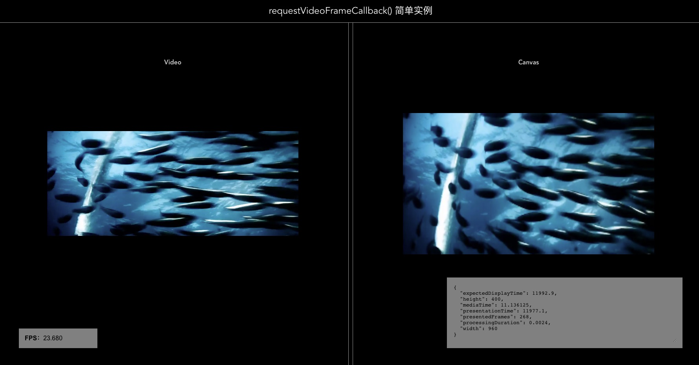

# VUE VIDEO STREAM

一个简单的全栈视频流传输 WEB 应用

### express-service

视频流后端服务，进入目录，执行命令安装依赖：

```
npm install
```

启动命令：

```
npm run start
```

调试命令：

```
npm run debug
```

预览地址：`http://127.0.0.1:8100/`

### video-web

VUE 前端视频播放应用，展示视频播放。

进入项目目录，安装依赖：：

```
yarn install
```

启动命令：

```
yarn serve
```

效果如下：



### 个人自媒体

-   个人网站：[https://www.devpoint.cn/index.shtml](https://www.devpoint.cn/index.shtml)
-   infoQ：[https://www.infoq.cn/u/devpoint/](https://www.infoq.cn/u/devpoint/)
-   掘金：[https://juejin.cn/user/4406498333033918](https://juejin.cn/user/4406498333033918)
